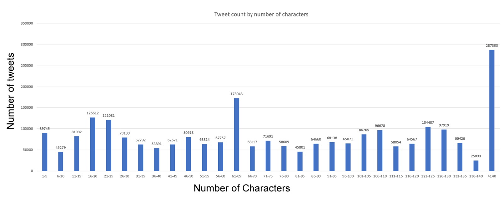
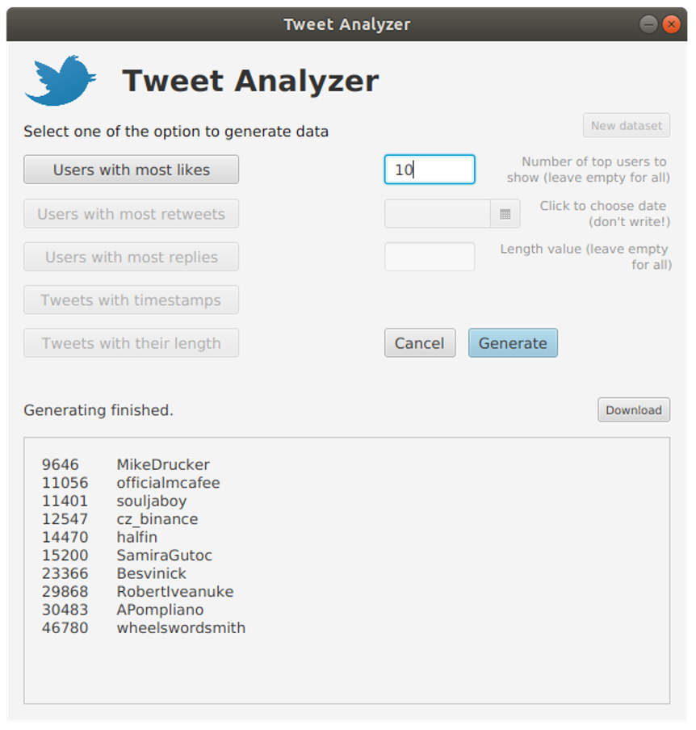

<h1 align=left>Tweet Analyzer. MapReduce Implementation</h1>

The goal of this project was to develop several MapReduce programs to analyze the provided dataset. The dataset includes tweets containing Bitcoin (BTC) from 01/01/2016 to 29/03/2019. The tasks to be analyzed are as follows:

1. The users who have the most likes.
2. The users who have the most retweets.
3. The users who have the most replies.
4. Number of tweets that were posted on a specific day.
5. Number of tweets that have specific number of characters.

This was a collaborative project for the Big Data course.

### Dataset
https://www.kaggle.com/alaix14/bitcoin-tweets-20160101-to-20190329

### Implementation
#### Most likes, retweets, and replies
The mapper class for these jobs maps all the users and the number of likes of their tweets in the form of key - value pairs. Through this steps, program also adds the given number of people that has most likes to a tree map. As tree map sorts the data inside of it, this operation is aimed to find the lead number of likes, retweets, replies of users’ tweets if it is requested.

The reducer class for this job adds all the number of likes for each user generated from mapper and puts them in a tree map in the form of sum - user pair. Appropriate classes with same functionalities exist for finding retweets and replies jobs too.

#### Number of tweets for each/specific day
The mapper class for this job maps all the tweets and their posted dates in a key – value pairs. The additional optional parameter provided by the user decides whether to generate the data for all dates from the dataset, or generate data only for the specific date. The date format is YYYY/MM/DD.

The reducer class for this job sums all the individual time stamps which are posted dates for tweets generated from the mapper class and the sums of them are the results for number of tweets posted for each days.

#### Number of tweets with the number of characters
The mapper class for this job maps all the tweets by the number of their length in the form of ranges. Characters below 140 are divided into several groups, for example 20-25. However, tweets that have above 140 characters are not divided into any groups as there were a lot of tweets with length over 140. If the specific length is not specified by the user, the generated data will print all the number of tweets with appropriate length.

The reducer class for this job counts the number of ranges of tweets’ lengths that have same number of characters.

### Compile
This project is written using Java 8 version. GUI part of the application is developed with JavaFX library. Hadoop version that's used was 3.2.1. All the development process was on Linux Ubuntu 18.04 OS. IDE used for this project was IntelliJ IDEA.

### Results
Below is the result showing the number of tweets with range of characters.

### Screenshot
